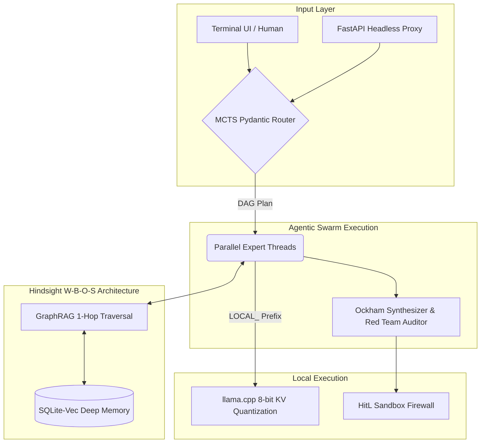

# 🧠 Vromlix Prime v4.0: Cognitive Edge Architecture

An advanced, deterministic Multi-Agent Orchestration system engineered for sovereign, high-performance execution in severely resource-constrained environments (Sub-8GB RAM edge computing). 

## 🏗️ System Architecture & Workflow

Vromlix operates under a strict deterministic delegation model. It replaces zero-shot LLM guessing with Monte Carlo Tree Search (MCTS) routing, and flat RAG with a topological GraphRAG memory system, ensuring zero-hallucination outputs.

## 🚀 Technical Highlights

* **MCTS-Driven MoE Routing:** Replaces fragile zero-shot routing with a lightweight Monte Carlo Tree Search (MCTS) heuristic. The system mathematically simulates and scores multiple Directed Acyclic Graph (DAG) execution paths via Pydantic before delegating tasks.
* **Edge-Optimized GraphRAG & W-B-O-S Memory:** Eliminates context amnesia by implementing a Hindsight epistemic memory taxonomy (World, Biographical, Opinion, Summary). Utilizes SQLite Recursive CTEs for 1-Hop neighborhood traversal, achieving GraphRAG capabilities without heavy JVM graph databases.
* **Dual-LLM Maker-Checker Paradigm:** Secures autonomous code generation by deploying an adversarial architecture. A Surgeon agent generates code mutations, which are mathematically verified by an isolated Forensic Auditor, and finally intercepted by a strict Human-in-the-Loop (HitL) Sandbox Firewall before OS-level execution.
* **Sovereign Edge Compute (Anti-OOM):** Executes local LLMs (Phi-4) strictly within an 8GB RAM ceiling by implementing 8-bit Key-Value (KV) Cache quantization and dynamic context compression via `llama-cpp-python`.
* **Headless Benchmarking Proxy:** Features a decoupled FastAPI proxy server, allowing autonomous machine-to-machine evaluation against industry-standard benchmarks (SWE-bench, GAIA) without UI blocking.
* **Resilient API Multiplexing:** Native `google-genai` integration fortified with an Active Key Manager (Round-Robin) to effortlessly absorb HTTP 429/503 errors and maximize throughput under strict TPM quotas.
* **Map-Reduce OSINT Pipelines:** Automated intelligence gathering scripts that autonomously scrape, semantically filter (enforcing strict GitHub star thresholds), and synthesize ArXiv papers and corporate RSS feeds into actionable JSON payloads.

## 🛠️ Stack & Dependencies
- **Core Engine:** Python 3.12, `pydantic` (Deterministic DAGs), `FastAPI`
- **Edge AI & Memory:** `llama-cpp-python`, `sqlite-vec` (C++ WASM)
- **LLM Orchestration:** `google-genai` (Gemini 3.0 Flash/Pro)
- **OSINT & Scraping:** `feedparser`, `requests` (Map-Reduce Pipelines)

---
*Built for rigorous Personal Knowledge Graph compilation and continuous code refactoring.*